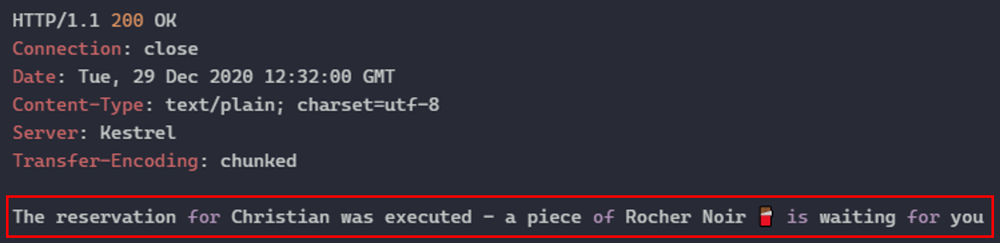

# Season of Serverless - Challenge Week 6

This repository contains the solution for the Season of Serverless Challenge week 6 aka "The Magic Chocolate Box" via Azure Functions and Durable Entities in TypeScript

## Solution Components

The solution is a combination of Azure Functions 8serving as `durableClients` and Azure Durable Entities for storing the state:

* Azure Durable Entity `ChocolateBoxEntity`: This entity stores the available amount of chocolate per chocolate type. It constraints the maximum amount of chocolate per type to two pieces.
* Azure Durable Entity `ReservationEntity`: This entity stores the reservation of chocolate per person.
* Azure Function `ReserveChocolate`: This functions offer a `POST` endpoint for reserving chocolate for a person. You must provide the input parameters via JSON e. g.
  
  ```JSON
  {
    "name": "Christian",
    "type": "Rocher Noir"
  }  
  ```

* Azure Function `ChocolateReservationStatus`: This functions offer an endpoint available to `GET` and `DELETE`. It accepts the query parameter `name`.
  * `GET` fetches the current status of a reservation for the person handed over via the query parameter
  * `DELETE` removes the reservation for the person handed over via the query parameter

## Internal Design

We assume that we indeed have a __magic__ chocolate box, so you can reserve each type of chocolate. The only constraint of the magic is that per type/variant of chocolate there are only two pieces available.

What scenarios can we execute?

### No reservation available?

Let us first check if we have a reservation available via `GET  http://localhost:7071/api/ChocolateReservationStatus?name=Christian`


Okay, then let us reserve some ...

### Reservation of a chocolate

We decide to reserve some "Rocher Noir" via

```HTTP
POST  http://localhost:7071/api/ReserveChocolate HTTP/1.1
content-type: application/json

{
    "name": "Christian",
    "type": "Rocher Noir"
}
```



Let us check that this was successful via `GET  http://localhost:7071/api/ChocolateReservationStatus?name=Christian`


Cool. But one chocolate is not enough, let us try to get another one

### Trying to trick

Why not reserve an additional one of "Rocher Noir"?


hmmm ... perhaps a different type via

```HTTP
POST  http://localhost:7071/api/ReserveChocolate HTTP/1.1
content-type: application/json

{
    "name": "Christian",
    "type": "Rocher Noir"
}
```


Okay that did not work, there is indeed only one piece per person.
### No more chocolate available

Let another person called Linda reserve a piece of "Rocher Noir":


What if Petra also wants a piece of "Rocher Noir"


Okay ... at least a cookie if one cannot reserve the desired type.

### Switching to a different chocolate

What did Christian reserve again?


Ah no I do not want that, I want to have a "Rocher Lait". I want to revoke my reservation via `DELETE  http://localhost:7071/api/ChocolateReservationStatus?name=Christian`


Now I should be able to reserve the other type:


## How to execute

You can run the scenario locally via `npm run start`. Several HTTP calls are available in the file `requests.http` (required: [REST CLient extension in VSCode](https://marketplace.visualstudio.com/items?itemName=humao.rest-client)).
As a prerequisite you need to have the [Azure Storage Emulator](https://docs.microsoft.com/en-us/azure/storage/common/storage-use-emulator) up and running. The `local.settings.json` is part of the repository and contains the relevant setting of the `AzureWebJobsStorage` parameter for local development. 